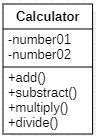

# Ανάλυση Σχεδίαση Συστήματος

Σε αυτήν την περιοχή θα πρέπει να υπάρχει:
- [ ] Ένα **διάγραμμα κλάσεων** με τουλάχιστον 2 νέες κλάσεις.
- [ ] Ένα ακόμα **διάγραμμα** της επιλογής σας.

### Παράδειγμα:

